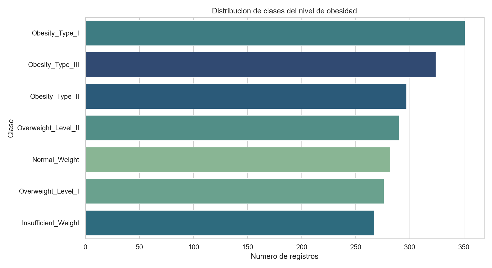
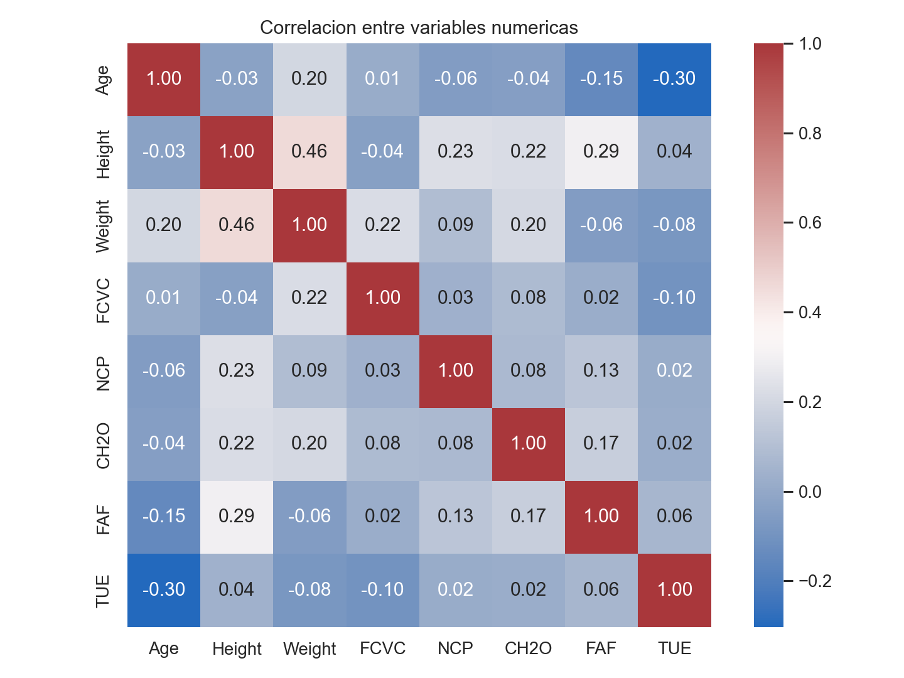
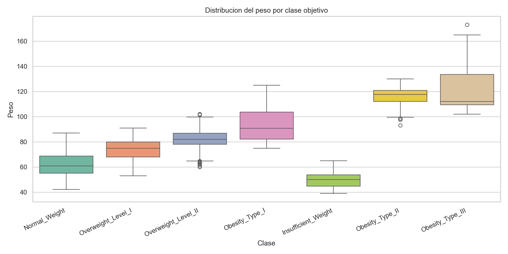
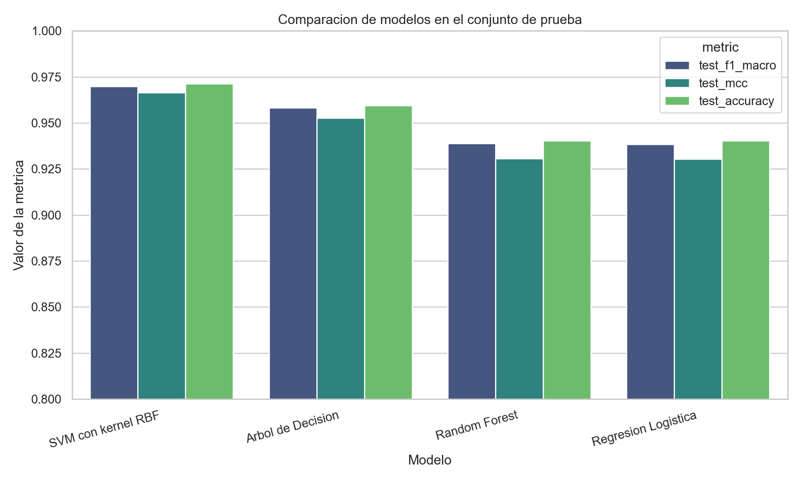
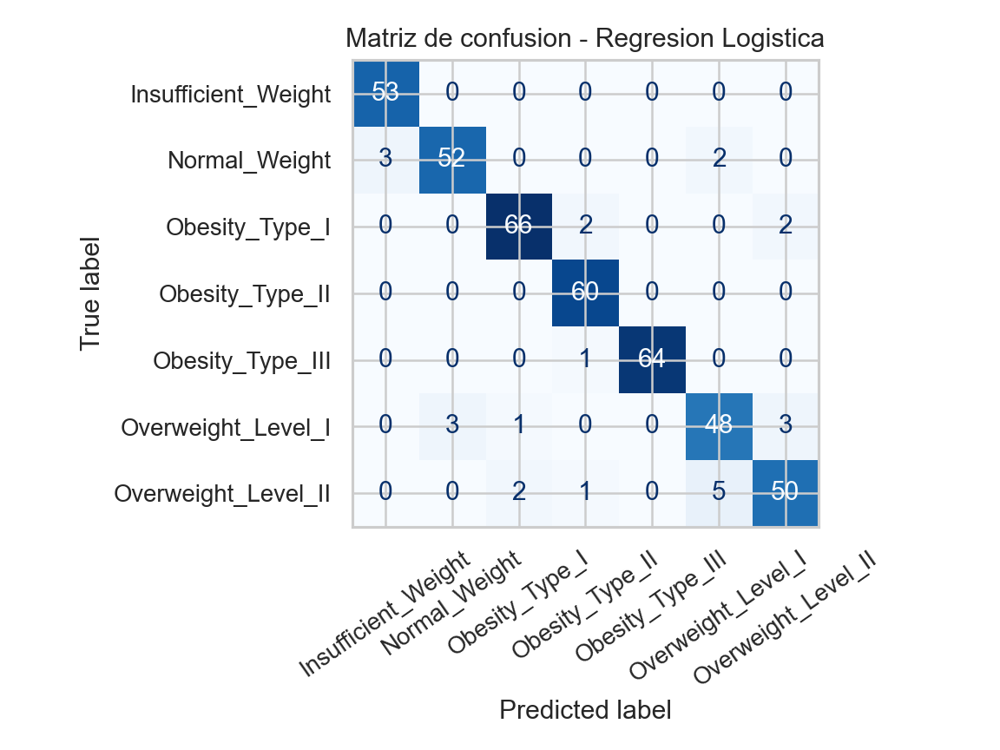
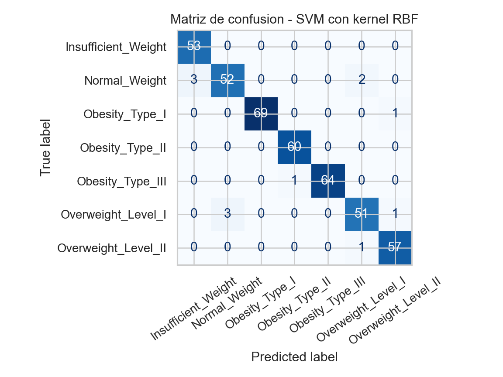
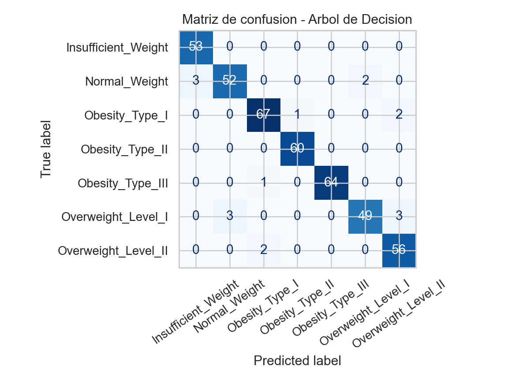
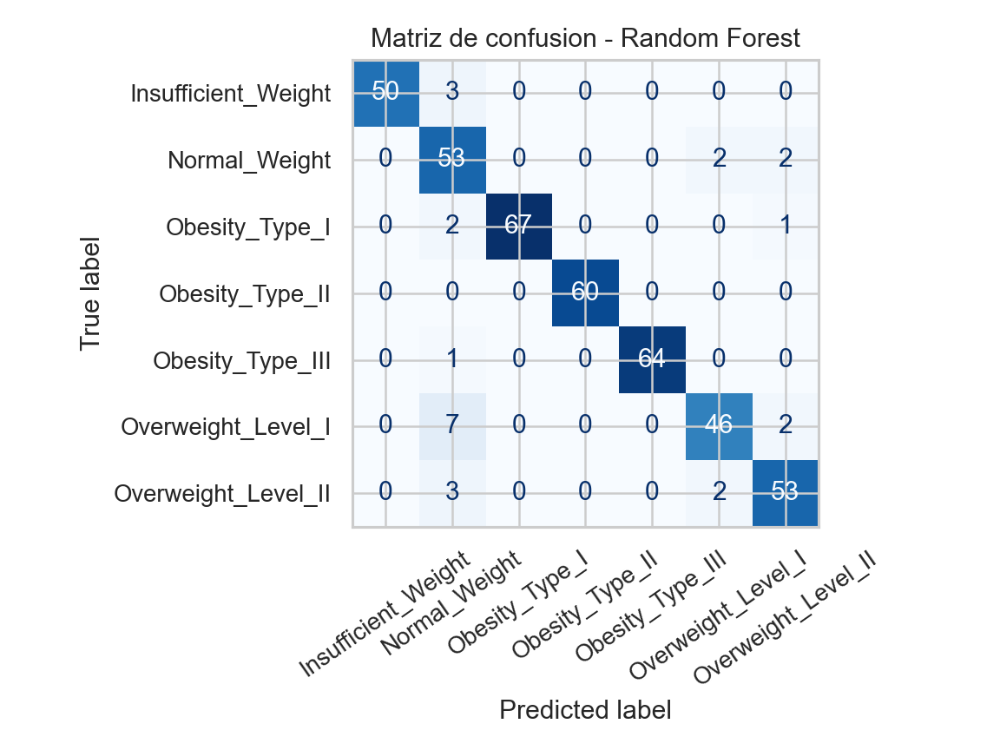
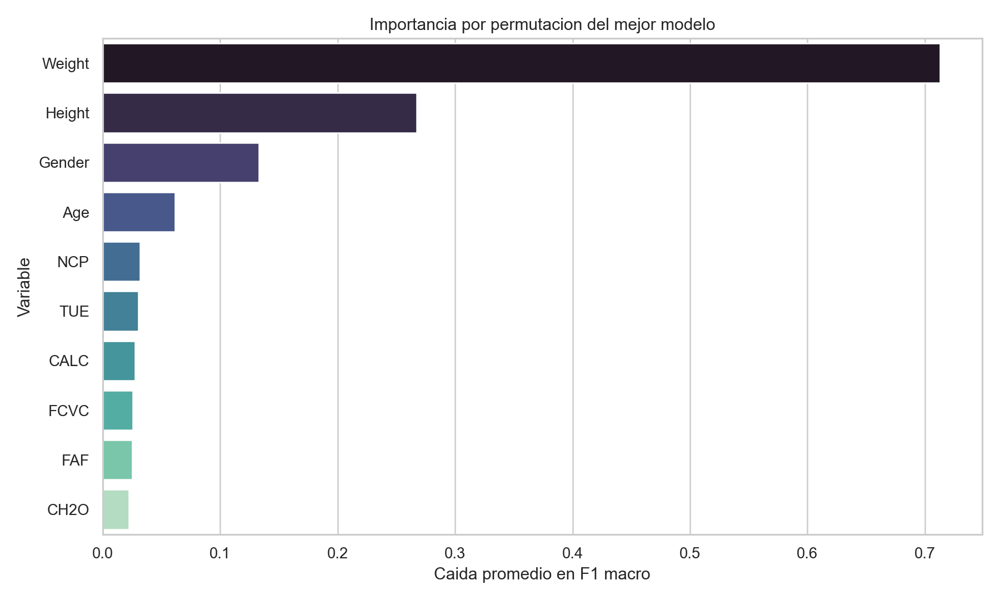

# MiniProyecto 2 - Problema de Clasificacion

## Integrantes

- Valentina Popo Montilla
- Juan Camilo Balleresteros Sierra
- Santigo Rodriguez Gacha

## 1. Descripcion del dataset

Se utilizo el dataset **Estimation of Obesity Levels Based On Eating Habits and Physical Condition** del repositorio UCI. El conjunto contiene informacion de habitos de alimentacion, condicion fisica y caracteristicas antropometricas para clasificar el nivel de obesidad de una persona.

- Registros originales: **2111**
- Variables originales: **17**
- Variables numericas: **8**
- Variables categoricas: **8** predictoras + la variable objetivo
- Variable objetivo: **NObeyesdad**
- Clases objetivo: **7**
- Valores faltantes detectados: **0**
- Filas duplicadas exactas detectadas: **24**

Distribucion de clases:

Clase | Frecuencia
--- | ---
Insufficient_Weight | 272
Normal_Weight | 287
Obesity_Type_I | 351
Obesity_Type_II | 297
Obesity_Type_III | 324
Overweight_Level_I | 290
Overweight_Level_II | 290



## 2. Analisis exploratorio y depuracion de variables

Se aplico un proceso de depuracion con las siguientes reglas:

1. Eliminar columnas con mas del 50% de valores faltantes.
2. Eliminar columnas con varianza cero.
3. Revisar correlaciones numericas absolutas mayores a 0.85 para evitar redundancia.
4. Eliminar filas duplicadas exactas.

Resultados de la depuracion:

- Columnas con mas del 50% de faltantes: **0**
- Columnas con varianza cero: **0**
- Pares numericos con correlacion mayor a 0.85: **0**
- Columnas eliminadas por depuracion: **Ninguna**
- Filas duplicadas eliminadas: **24**
- Registros finales para modelado: **2087**

En este dataset no fue necesario eliminar variables por faltantes, varianza cero o alta correlacion. La limpieza se concentro en retirar los duplicados exactos, quedando un conjunto final de **2087** registros.

La matriz de correlacion de las variables numericas se presenta a continuacion:



Como variable ilustrativa, el peso muestra una separacion clara entre varias clases objetivo:



## 3. Division del dataset y metodologia

Para entrenar y validar los modelos se realizo una particion estratificada:

- Entrenamiento: **1669** registros
- Prueba: **418** registros
- Proporcion de prueba: **20%**
- Semilla aleatoria: **42**

Las variables numericas fueron imputadas con la mediana y estandarizadas. Las variables categoricas fueron imputadas con la moda y codificadas mediante **One-Hot Encoding**. El ajuste de hiperparametros se realizo con **GridSearchCV** de 5 particiones, optimizando la metrica **F1 macro**.

## 4. Modelos de clasificacion evaluados

Se entrenaron cuatro modelos:

1. **Regresion Logistica** - modelo lineal multiclase visto en clase.
2. **SVM con kernel RBF** - modelo visto en clase.
3. **Arbol de Decision** - modelo visto en clase.
4. **Random Forest** - modelo adicional no visto en clase. Este metodo combina multiples arboles de decision y toma la clase final por votacion, lo que suele mejorar la estabilidad frente a un arbol individual.

## 5. Comparacion de resultados

Ademas de la matriz de confusion, se utilizo como indice adicional el **Matthews Correlation Coefficient (MCC)**, una metrica robusta para problemas multiclase porque resume la calidad global de la clasificacion considerando verdaderos y falsos positivos y negativos.

label | course_type | cv_f1_macro | test_accuracy | test_balanced_accuracy | test_f1_macro | test_mcc
--- | --- | --- | --- | --- | --- | ---
SVM con kernel RBF | Visto en clase | 0.9546 | 0.9713 | 0.9704 | 0.9697 | 0.9665
Arbol de Decision | Visto en clase | 0.9318 | 0.9593 | 0.9586 | 0.9583 | 0.9526
Random Forest | No visto en clase | 0.9334 | 0.9402 | 0.9379 | 0.9389 | 0.9307
Regresion Logistica | Visto en clase | 0.9352 | 0.9402 | 0.9392 | 0.9383 | 0.9303



Matrices de confusion generadas:

- 
- 
- 
- 

## 6. Mejor modelo e hiperparametros

El mejor modelo del experimento fue **SVM con kernel RBF**, ya que obtuvo los mejores valores en el conjunto de prueba tanto para **F1 macro** (**0.9697**) como para **MCC** (**0.9665**).

Hiperparametros optimos encontrados:

```json
{
  "model__C": 10,
  "model__gamma": 0.03,
  "model__kernel": "rbf"
}
```

Las variables con mayor influencia estimadas mediante importancia por permutacion fueron:



## 7. Conclusiones

1. El dataset presenta una estructura relativamente limpia: no tiene valores faltantes y tampoco muestra columnas con varianza cero ni correlaciones numericas extremas. La principal accion de depuracion fue eliminar **24** registros duplicados.
2. Los cuatro modelos alcanzaron desempenos altos, lo que sugiere que las variables del dataset contienen informacion suficiente para distinguir las clases objetivo.
3. **SVM con kernel RBF** fue el modelo mas solido al generalizar, con mejor **F1 macro** y mejor **MCC** en el conjunto de prueba. Esto indica una mejor capacidad para separar fronteras no lineales entre los distintos niveles de obesidad.
4. Aunque el **Arbol de Decision** obtuvo un resultado competitivo, fue ligeramente inferior al SVM en las metricas globales, por lo que no seria la primera opcion para esta aplicacion.
5. **Random Forest**, como metodo adicional no visto en clase, mostro un rendimiento estable, pero en esta base no supero al SVM. Su principal ventaja sigue siendo la interpretabilidad agregada y la robustez frente a variaciones en los datos.
6. Para esta aplicacion concreta, el modelo recomendado es **SVM con kernel RBF**, porque ofrece el mejor equilibrio entre precision global, sensibilidad promedio por clase y correlacion global de las predicciones.
7. Como limitacion metodologica, el propio UCI reporta que cerca del 77% de los datos fue generado sinteticamente con SMOTE. Por eso, aunque el desempeno es alto, los resultados deben interpretarse con cautela al extrapolarlos a poblaciones reales.

## 8. Archivos generados

- Script principal: `src/run_analysis.py`
- Notebook: `notebooks/miniproyecto_2_clasificacion_obesidad.ipynb`
- Resultados tabulares: `reports/results/`
- Figuras: `reports/figures/`

